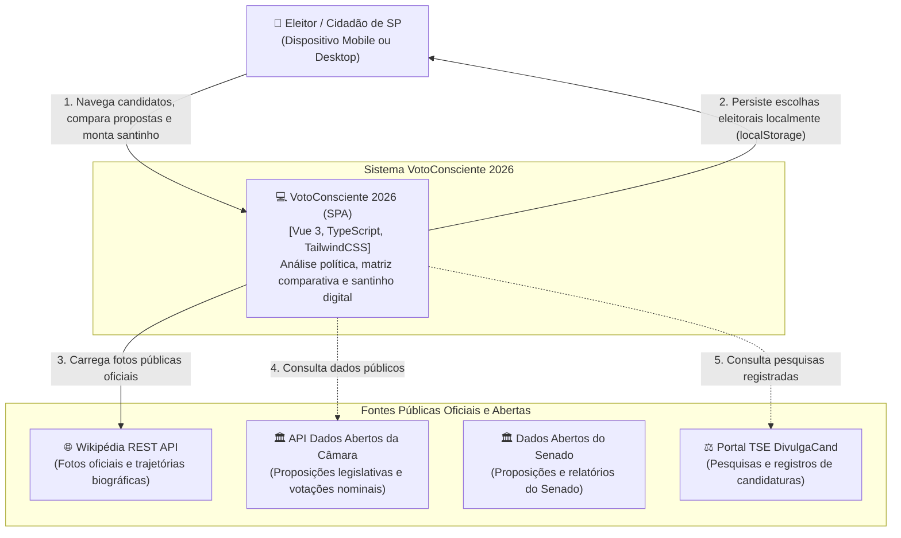
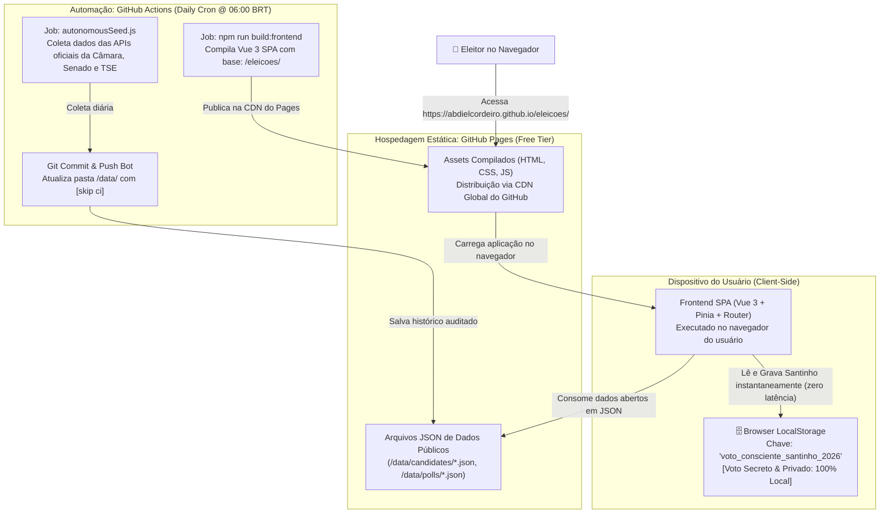
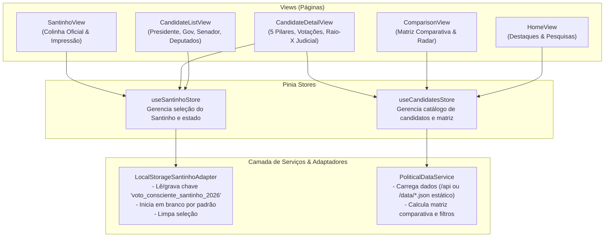
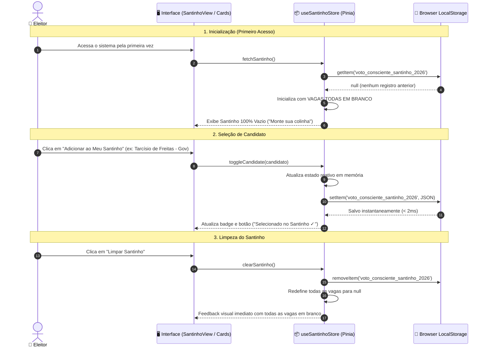

# System Design & Diagramas C4 - VotoConsciente 2026

Este documento descreve a arquitetura de software, padrões e topologias de implantação do **VotoConsciente 2026**, detalhando os diagramas C4 em Mermaid.js e os fluxos de dados locais (Privacy by Design).

---

## 1. Visão Geral da Arquitetura

O sistema foi concebido sob o paradigma **Jamstack / Free Tier First**, operando em dois modos complementares:
1. **Modo Estático Standalone (Hospedagem em GitLab Pages / CDN):**
   - O Frontend Vue.js 3 é servido como Single Page Application (SPA) ultra-leve e estática diretamente pelos servidores globais do GitLab Pages.
   - O armazenamento das preferências do usuário (Meu Santinho Digital) ocorre exclusivamente no `localStorage` do navegador do cliente (zero dados enviados para servidores externos, garantindo privacidade absoluta nos termos da LGPD).
   - As bases de dados de candidatos (`/data/candidates/*.json`) e pesquisas eleitorais (`/data/polls/*.json`) são servidas como assets públicos estáticos versionados.
2. **Modo Fullstack Local / Híbrido (Desenvolvimento & Coleta Autônoma):**
   - Backend Node.js / Fastify em Clean Architecture & Hexagonal Ports & Adapters para orquestrar coletas autônomas nas APIs públicas da Câmara, Senado e TSE.

---

## 2. Diagramas C4 (Mermaid.js)

### Nível 1: Diagrama de Contexto de Sistema (System Context)

---

### Nível 2: Diagrama de Contêineres (Container Diagram - Deploy GitHub Pages & Actions Cron)

---

### Nível 3: Diagrama de Componentes do Frontend

---

## 3. Fluxo de Privacidade do Santinho (Privacy by Design)

